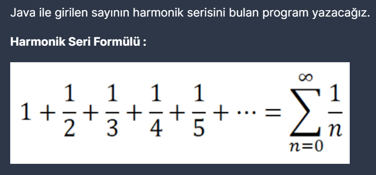

# PatikaJavaPractice07

```
The program that finds the harmonic series of the number entered in Java. 

Harmonic Series Formula : 1 + (1/2) + (1/3) + (1/4) + (1/n)
```

```
Java ile girilen sayının harmonik serisini bulan program.

Harmonik Seri Formülü : 1 + (1/2) + (1/3) + (1/4) + (1/n)
```
[Patika](https://www.patika.dev)




