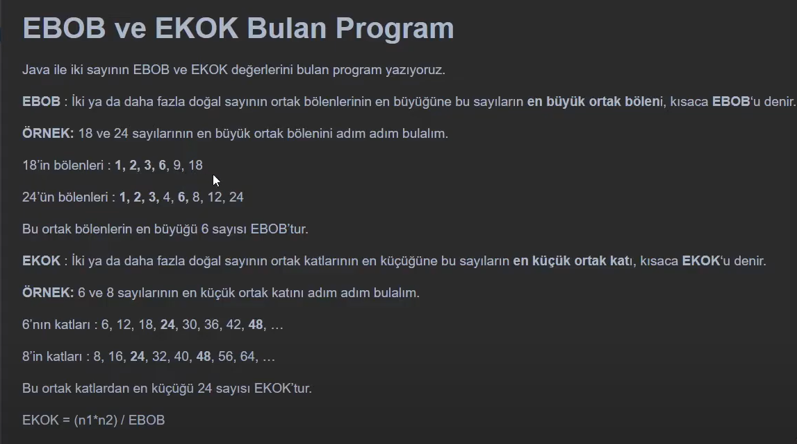

# PatikaJavaPractice10
```
A program that finds the EBOB and EKOK values of two numbers in Java.
```

```
Java ile iki sayının EBOB ve EKOK değerlerini bulan program.
```

[Patika](https://www.patika.dev)


