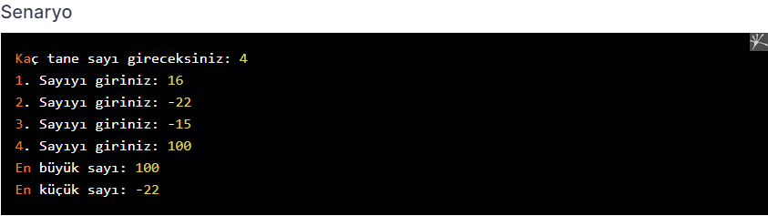

# PatikaJavaPractice11
```
A Java program that finds the largest and smallest numbers from N counting numbers 
entered from the keyboard and writes these numbers to the screen.
```

```
Java ile klavyeden girilen N tane sayma sayısından en büyük ve en küçük sayıları bulan 
ve bu sayıları ekrana yazan program.
```

[Patika](https://www.patika.dev)


