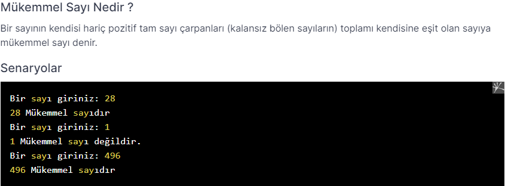

# PatikaJavaPractice12
```
It finds whether a number entered from the keyboard is a perfect number, 
and if the number is a perfect number, "it is the perfect number." 
if not, "it's not a perfect number." 
A program that writes expressions to the screen.
```

```
Klavyeden girilen bir sayının mükemmel sayı olup/olmadığını bulan
ve sayı mükemmel sayı ise ekrana “mükemmel sayıdır.” 
değilse “mükemmel sayı değildir.” ifadelerini ekrana yazan program.
```

[Patika](https://www.patika.dev)


