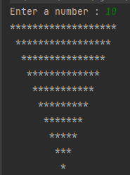

# PatikaJavaPractice13
```
Program that takes the number of digits from the user in Java 
and draws an inverted triangle to the screen with asterisks(*) using loops.
```

```
Java ile basamak sayısının kullanıcıdan alınan ve döngüler kullanılarak, 
yıldızlar(*) ile ekrana ters üçgen çizen program.
```


[Patika](https://www.patika.dev)


