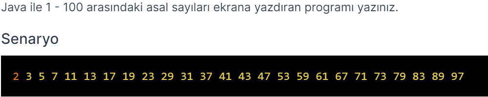

# PatikaJavaPractice14
```
A Java program that prints prime numbers from 1 to 100.
```

```

Java ile 1 - 100 arasındaki asal sayıları ekrana yazdıran program.
```

[Patika](https://www.patika.dev)


