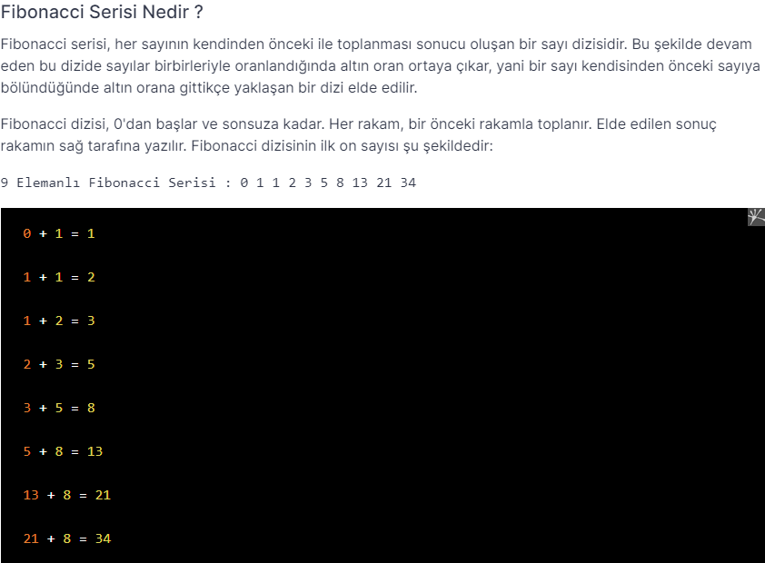

# PatikaJavaPractice15
```
Program to find fibonacci series with Java loops according to the number received from the user.
```
```
Kullanıcıdan alınan sayıya göre Java döngüler ile fibonacci serisi bulan program.
```

[Patika](https://www.patika.dev)


