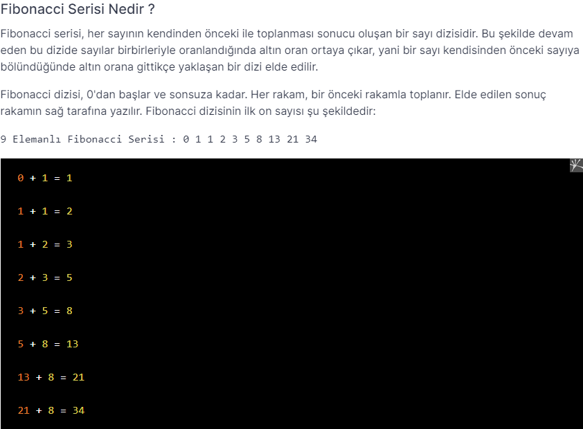

# PatikaJavaPractice15
```
Program that prints the sequential fibonacci number received from the user.
```
```
Kullanıcıdan alınan sıradaki fibonacci sayısını yazdıran program.
```

[Patika](https://www.patika.dev)


