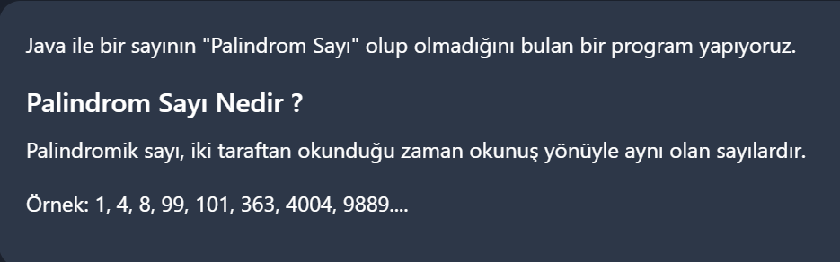

# PatikaJavaPractice16
```
A program that finds whether a number is a "Palindrome Number" in Java.
```
```
Java ile bir sayının "Palindrom Sayı" olup olmadığını bulan bir program.
```

[Patika](https://www.patika.dev)


