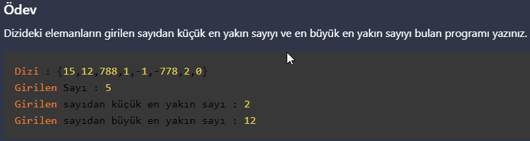

# PatikaJavaPractice21
```
A program that finds the closest number smaller than the entered number and 
the closest number larger than the entered number of the elements in the array.
```
```
Dizideki elemanların girilen sayıdan küçük en yakın sayı ile 
büyük en yakın sayıyı bulan program.
```


[Patika](https://www.patika.dev)


