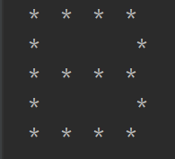

# PatikaJavaPractice22
```
A program that prints the letter "B" with "stars" using multidimensional arrays.
```
```

Çok boyutlu diziler kullanarak "yıldızlar" ile ekrana "B" harfi  yazdıran program.
```


[Patika](https://www.patika.dev)


