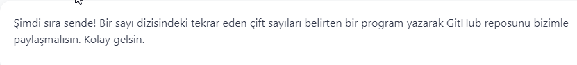

# PatikaJavaPractice23
```
A program that specifies repeating even numbers in a string of numbers.
```
```
Bir sayı dizisindeki tekrar eden çift sayıları belirten bir program.
```


[Patika](https://www.patika.dev)


