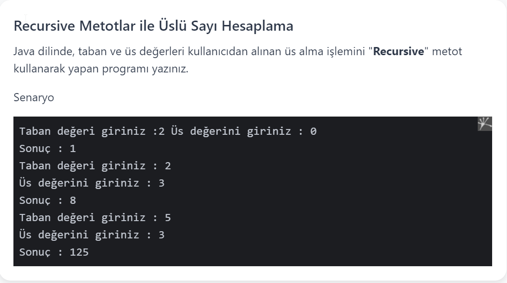

# PatikaJavaPractice26
```
A program in Java language that uses the "Recursive" method for exponentiation, 
whose base and exponent values are taken from the user.
```
```
Java dilinde, taban ve üs değerleri kullanıcıdan alınan üs alma işlemini 
"Recursive" metot kullanarak yapan program.
```


[Patika](https://www.patika.dev)


