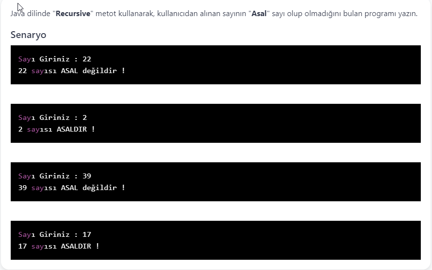

# PatikaJavaPractice27
```
A program that finds whether the number received from the user is a "Prime" number, 
using the "Recursive" method in Java language.
```
```
Java dilinde "Recursive" metot kullanarak, kullanıcıdan alınan sayının
 "Asal" sayı olup olmadığını bulan program.
```


[Patika](https://www.patika.dev)


