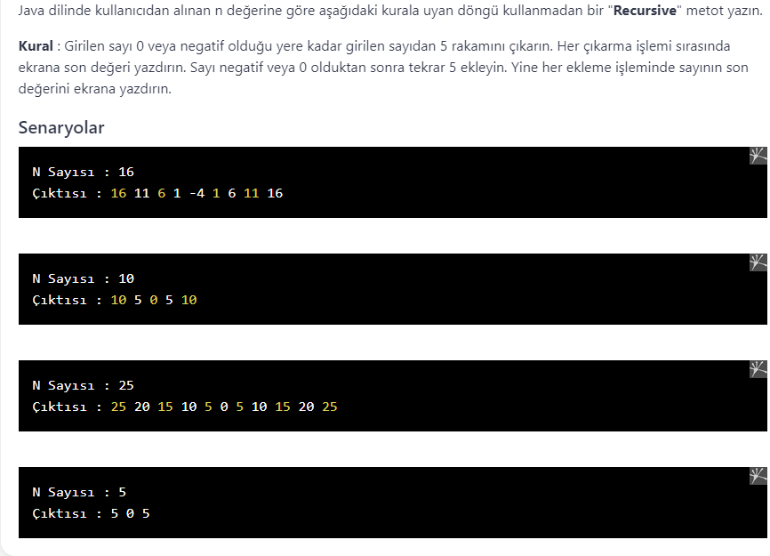

# PatikaJavaPractice28
```
A "Recursive" method without looping, which conforms to the rule in the picture below,
 according to the "n" value received from the user in Java language.
```
```
Java dilinde kullanıcından alınan "n" değerine göre aşağıdaki resimde 
yer alan kurala uyan döngü kullanmadan bir "Recursive" metot.
```


[Patika](https://www.patika.dev)


