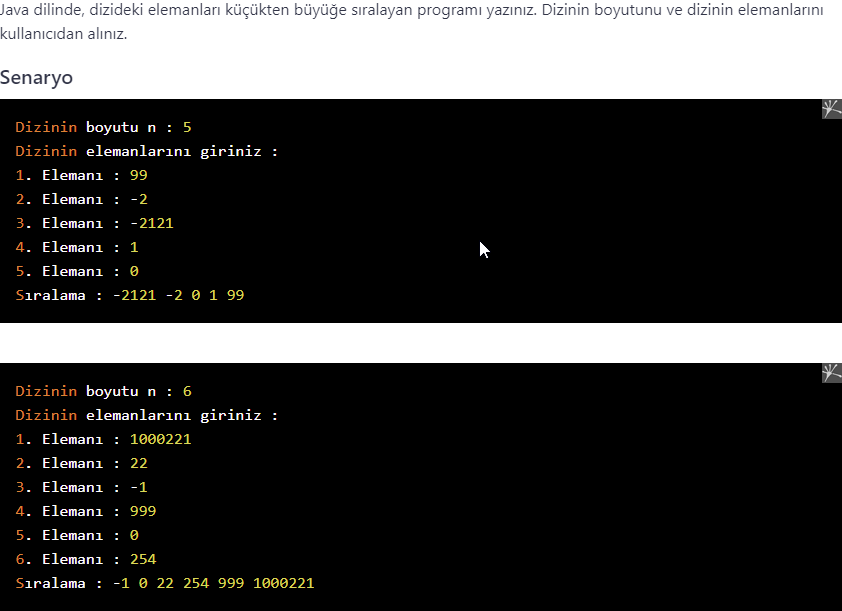

# PatikaJavaPractice30
```
Write a program in Java that sorts the elements of the array from smallest to largest. 
Get the size of the array and the elements of the array from the user.
```
```
Java dilinde, dizideki elemanları küçükten büyüğe sıralayan programı yazınız. 
Dizinin boyutunu ve dizinin elemanlarını kullanıcıdan alınız.
```


[Patika](https://www.patika.dev)


