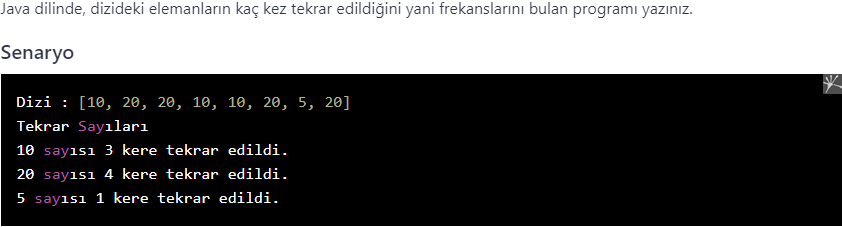

# PatikaJavaPractice31
```
Program in Java language that finds the frequency of the elements
 in the array.
```
```
Java dilinde, dizideki elemanların kaç kez tekrar edildiğini 
yani frekanslarını bulan program.
```


[Patika](https://www.patika.dev)


dizideki frekanslar
