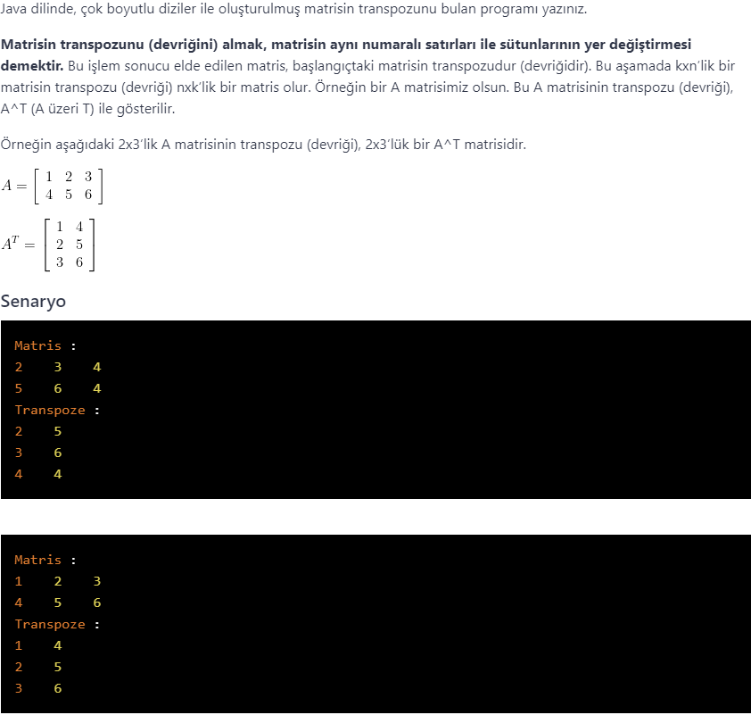

# PatikaJavaPractice32
```
Java language program that finds the transpose of a matrix created with multidimensional arrays.
```
```
Java dilinde, çok boyutlu diziler ile oluşturulmuş matrisin transpozunu bulan program.
```


[Patika](https://www.patika.dev)


